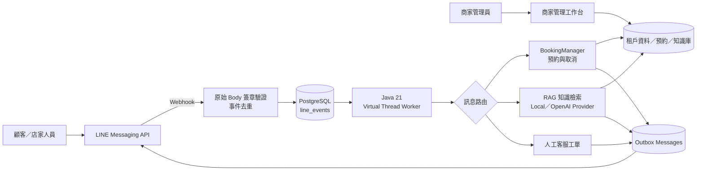

# LINE AI 智慧客服與預約管理平台

> 面向中小型商家的多租戶 LINE 客服平台，整合 AI 知識庫問答、線上預約、店家人員管理與即時通知。

[](https://github.com/Luzhe1002/Line-AI-Bot/actions/workflows/ci.yml)

[線上工作台](https://line-ai-bot-mj1n.onrender.com/portal/) ·
[系統架構](docs/architecture.md) ·
[專案稽核](docs/project-review.md) ·
[履歷專案稿](docs/portfolio.md) ·
[API 操作範例](docs/api-examples.http)

## 專案概覽

顧客可以直接透過 LINE 詢問商家資訊，由系統從該商家的已發布知識庫檢索資料並產生附有來源的回答；需要預約時，則開啟綁定 LINE 身分的行動預約頁選擇時段。店家人員可沿用同一個 LINE 官方帳號查詢、取消及管理預約，不必另外安裝管理 App。

系統採 Java 21／Spring Boot 4 模組化單體架構，使用 Spring JDBC、Flyway 與 PostgreSQL。原 FastAPI 原始碼保留作為遷移與 HTTP 契約比對用途，目前不由 Docker Compose 啟動。

| 使用者 | 主要功能 |
|---|---|
| 顧客 | LINE 知識問答、來源引用、人工客服轉接、行動預約與取消通知 |
| 店家人員 | LINE 身分綁定、預約查詢與取消、時段封鎖、即時通知、每日摘要 |
| 商家管理員 | 建立商家、設定 LINE Channel 與營業時間、管理知識庫版本與人員權限 |

## 核心架構



- **LINE 訊息：** Webhook 驗證與去重後先寫入資料庫，再交由有界並行 Worker 處理，降低模型延遲並避免程序重啟造成事件遺失。
- **AI 問答：** 只檢索相同 `tenant_id`、已發布資料集及相符 Embedding 設定的內容；引用由後端建立，資料不足時轉人工客服。
- **預約寫入：** 所有建立與取消都由 `BookingManager` 執行，搭配冪等鍵與資料庫唯一時段限制避免重複預約。

完整設計與安全邊界請見 [系統架構](docs/architecture.md)，Message Broker 的取捨與演進條件請見 [ADR-0001](docs/adr/0001-message-queue.md)。

## 技術棧

| 類別 | 技術 | 使用方式 |
|---|---|---|
| Backend | Java 21、Spring Boot 4、Spring MVC、Spring JDBC | REST API、模組化商業邏輯與資料存取 |
| Database | PostgreSQL、H2、Flyway | 正式資料庫、本機開發與版本化 Schema Migration |
| AI／RAG | OpenAI Embeddings、Responses API、Local Provider | 文件切塊、向量檢索、可信回答與離線測試 |
| LINE | LINE Messaging API、HMAC-SHA256 | Webhook、Reply／Push Message、Quick Reply 與 Postback |
| 非同步處理 | Java Virtual Threads、Database-backed Queue、Outbox | 事件持久化、Claim、重試、過期復原及傳送稽核 |
| Frontend | HTML、CSS、JavaScript | 商家工作台、顧客預約頁與店家手機管理頁 |
| Delivery | Docker Compose、Render | 容器化本機環境與雲端測試部署 |
| Testing | JUnit、Spring Boot Test、H2、Node Test、Playwright | Java 主架構整合測試、前端邏輯與瀏覽器流程測試 |

## 工程設計亮點

- **多租戶隔離：** 所有可由使用者指定資源的商家資料存取都以 `tenant_id` 限定，並區分 Platform Admin、Tenant Admin 及 OWNER／MANAGER／VIEWER 權限。
- **可靠事件處理：** LINE 事件先落庫，以條件式 Claim、最多三次重試及逾時復原支援至少一次處理；Outbox 保留回覆與通知結果。
- **預約一致性：** 冪等鍵避免相同請求重複建立，預約與店家封鎖共用資料庫時段占用限制，並在同一交易內競爭時段。
- **可信 AI 邊界：** AI 只能輸出文字，無法直接異動預約；檢索內容受租戶、資料集版本、模型與維度限制。
- **敏感資料保護：** 管理 API Key 以雜湊保存，LINE Secret／Token 加密保存；工作台使用 HttpOnly Session、CSRF Token 及短效單次憑證。
- **可替換 AI Provider：** 預設 Local Provider 可完全離線執行與測試，也可切換 OpenAI Provider；更換模型或維度時保留重新索引流程。

## 線上展示

- 商家管理工作台：<https://line-ai-bot-mj1n.onrender.com/portal/>

測試環境若處於休眠，第一次開啟可能需要等待數十秒。顧客預約頁與店家手機管理頁需要由 LINE 產生綁定租戶及使用者的短效憑證，因此不提供匿名操作入口。
Production 展示站不公開 Swagger／OpenAPI；本機開發預設保留 `/docs` 與
`/openapi.json`，可用 `APP_API_DOCS_ENABLED` 控制。

## 主要功能

- 多租戶資料隔離，每個商家有獨立管理 API Key。
- Platform Admin、Tenant Admin 與店家人員角色驗證。
- LINE Channel Secret 與 Access Token 加密保存。
- LINE 原始 Body HMAC-SHA256 簽章驗證及 `tenant_id + webhookEventId` 去重。
- 持久化 `line_events`、有界 Virtual Thread Worker、失敗重試與 LINE Outbox 稽核。
- 一對一時段預約、冪等建立、取消釋放時段及店家封鎖共同占用限制。
- LINE 文字意圖、預約入口、取消確認、人工客服工單及店家管理指令。
- 店家人員綁定、角色專屬個人圖文選單、預約查詢、主動通知、每日摘要及手機月曆。
- 知識庫草稿、文件切塊、索引、重新索引、版本發布、租戶限定檢索與引用。
- 無外部 API Key 的 Local AI Provider，以及可選的 OpenAI Provider。
- H2 本機開發、PostgreSQL Docker 環境及 Flyway Schema 管理。

## 最快啟動方式：Docker

需求：Docker Desktop。

若尚未建立 `.env`：

```powershell
Copy-Item .env.example .env
```

保留現有 `.env` 時不要再次覆蓋。接著啟動：

```powershell
docker compose up --build
```

Compose 會啟動：

- Spring Boot API：<http://localhost:8000>
- Swagger UI：<http://localhost:8000/docs>
- OpenAPI JSON：<http://localhost:8000/openapi.json>
- PostgreSQL／pgvector：`localhost:5432`

Flyway 會在 Spring Boot 啟動時自動執行。

## 不用 Docker 的本機啟動

需求：JDK 21 與 Maven 3.9 以上。預設會使用專案目錄中的 H2 檔案資料庫。

```powershell
mvn spring-boot:run
```

也可先打包：

```powershell
mvn clean verify
java -jar target/line-ai-bot-0.2.0-SNAPSHOT.jar
```

目前電腦若只有 Java 8，請使用 Docker，或先安裝 JDK 21；Spring Boot 4 不能在 Java 8 上執行。

## API 驗證

建立商家時要傳 Platform Admin Key：

```http
POST /api/v1/tenants
X-Platform-Admin-Key: <APP_PLATFORM_ADMIN_API_KEY>
```

建立成功後，回應中的 `admin_api_key` 只顯示一次。之後操作該商家時傳：

```http
X-Tenant-Api-Key: <admin_api_key>
```

若 Swagger 顯示：

```json
{"detail": "Invalid platform admin API key"}
```

代表 `X-Platform-Admin-Key` 沒有填入，或內容與目前 Java 程序讀到的 `.env` 不一致。修改 `.env` 後必須重新啟動容器或 Java 程序。

## 商家管理工作台

啟動服務後開啟：

```text
http://localhost:8000/portal/
```

工作台提供：

- 以 Tenant ID 與只顯示一次的商家管理 API Key 登入。
- 使用 Platform Admin Key 建立商家並直接進入首次設定流程。
- 顯示 LINE、營業設定、知識文件與發布狀態的完成度。
- 貼上知識內容，或上傳 UTF-8 TXT、Markdown、CSV（最多 100,000 字）。
- 查看文件索引狀態、編輯或刪除草稿文件、重新索引、測試 AI 回答與引用。
- 發布資料集及設定 LINE Channel。
- 產生一次性店家人員綁定碼、設定 OWNER／MANAGER／VIEWER 權限與通知偏好，
  或移除既有人員的 LINE 管理綁定。

已發布的資料集是唯讀快照。若在正式版畫面新增內容，工作台會自動複製成
下一版草稿；編輯與刪除只影響草稿，直到再次發布才會取代 LINE 使用中的版本。

API Key 只在登入交換時送到後端。登入後使用 HttpOnly Session Cookie，
寫入操作另要求 Session 專用 CSRF Token；工作台不會把 API Key 寫入
`localStorage` 或 `sessionStorage`。

正式 HTTPS 環境必須設定：

```dotenv
APP_SESSION_COOKIE_SECURE=true
```

## 店家在 LINE 管理預約

不需要另外建立一個店家專用 LINE 官方帳號。每個商家沿用目前提供顧客服務的
官方帳號，店家人員以自己的私人 LINE 加入該帳號並完成權限綁定。Webhook
會先以 `tenant_id + LINE User ID` 判斷是否為已授權人員；只有明確的店家
管理指令會進入管理流程，其他訊息仍可走一般客服流程。

首次設定：

1. 在 `/portal/` 的「店家人員」頁產生十分鐘有效、只能使用一次的綁定碼。
2. 店家人員用私人 LINE 在商家官方帳號聊天室傳送 `綁定 <綁定碼>`。
3. 正式 LINE 模式會在背景建立角色專屬的個人圖文選單並綁定到該人員。
4. 圖文選單同步前仍可輸入 `管理預約`、`今日預約`、`明日預約` 或
   `本週預約`；OWNER 也可輸入 `管理後台` 取得完整工作台連結。

日常操作：

- 一般顧客只會看到商家既有的預設圖文選單；系統不會把管理按鈕加入預設選單。
- 已綁定人員會看到優先權較高的個人圖文選單，可直接開啟管理入口、今日預約、
  未來七天預約或切回顧客預約流程。
- OWNER 點擊「管理後台」後，Webhook 會再次確認其綁定狀態與角色，再回覆十分鐘
  有效、單次使用的完整工作台登入連結。連結交換成 HttpOnly Session 後立即
  從網址移除。
- MANAGER／VIEWER 的主要入口只開啟預約管理頁；實際寫入權限仍由後端角色檢查。
- 人員被停權時會排入解除個人圖文選單，完成後自動回到顧客預設選單；角色變更
  與 LINE Channel 更新也會重新排程同步。
- 新預約與取消預約會透過可靠的 `booking_events` Worker 主動通知已啟用人員。
- 店家從 LINE 預約清單執行取消時，必須再次確認；實際異動仍由
  `BookingManager` 執行，並通知顧客。
- 「開啟預約月曆」使用十分鐘有效、單次交換的管理憑證。憑證交換成
  HttpOnly Session 後立即從網址移除，寫入操作另要求 CSRF Token。
- OWNER／MANAGER 可以封鎖或解除時段；VIEWER 只能查看。
- 啟用每日摘要後，系統會依商家時區在指定時間推送當日預約。

個人圖文選單使用獨立的資料庫同步工作，LINE API 暫時失敗不會回滾已完成的
人員綁定。工作會以漸進退避重試，並以 revision 避免舊工作覆蓋新的角色或停權
狀態。詳細生命週期、故障處理與正式環境檢查方式請見
[店家個人圖文選單操作手冊](docs/merchant-rich-menus.md)。

顧客輸入「預約」時，LINE 只提供「開啟預約頁」。系統不再用時段 Quick
Reply 直接建立無姓名預約；顧客必須在預約頁選擇時段並填寫姓名。

歷史客服對話不應直接索引。後續匯入流程會先做個資遮蔽、候選知識萃取與
商家人工核准，再把核准內容加入草稿資料集。

## LINE 測試模式

預設：

```dotenv
APP_LINE_API_ENABLED=false
```

Webhook 的簽章、事件去重、對話、預約與 Outbox 都會執行，但回覆只會在 `outbox_messages` 標記為 `SIMULATED`，不會真的呼叫 LINE。確認流程與 Channel 設定後，再改成：

```dotenv
APP_LINE_API_ENABLED=true
```

測試模式下仍會建立 `merchant_rich_menu_sync` 的期望狀態，但 Worker 不會呼叫
LINE 或假裝同步成功；切換為真實 LINE 模式後會處理既有 READY 工作。

公開測試時，`APP_PUBLIC_BASE_URL` 必須是 LINE 可連線的 HTTPS 網址，並將商家的 webhook 設定成：

```text
{APP_PUBLIC_BASE_URL}/webhooks/line/{tenantSlug}
```

目前 Render 測試環境已啟用真實 LINE API，公開網址為
`https://line-ai-bot-mj1n.onrender.com`。商家仍必須在工作台保存各自的
Channel Secret／Access Token，並在 LINE Developers Console 啟用對應 Webhook。

## AI 與 RAG

預設不需要 API Key：

```dotenv
APP_AI_PROVIDER=local
```

本機模式用可重現的雜湊向量及句子級擷取式回答，會只選取與問題最相關的一句，
適合測試索引、租戶隔離、引用與 LINE 流程，不等同正式語意模型。

啟用 OpenAI：

```dotenv
APP_AI_PROVIDER=openai
OPENAI_API_KEY=sk-...
APP_AI_GENERATION_MODEL=gpt-5.6-luna
APP_AI_EMBEDDING_MODEL=text-embedding-3-small
APP_AI_EMBEDDING_DIMENSIONS=512
```

目前 Render 測試環境已使用 OpenAI Provider；`OPENAI_API_KEY` 只存於
Render Secret，`render.yaml` 僅以 `sync: false` 宣告變數名稱。

OpenAI 請求使用 `store=false`，且傳送的 LINE User ID 會先轉成穩定 HMAC 識別碼。切換 Provider、Embedding 模型或維度後，既有資料集必須呼叫：

```http
POST /api/v1/tenants/{tenantId}/datasets/{datasetId}/reindex
```

## Message Queue 結論

目前不需要另外部署 RabbitMQ、Kafka 或 SQS。現階段是一個可部署單體，LINE 事件先寫入 PostgreSQL，再由具重試、失敗狀態、過期 Claim 復原及最多 8 個並行工作的 Worker 處理。這已移除「程序重啟就遺失工作」的問題，也避免多維護一個 Broker。

以下任一條件成立時再導入外部 MQ：

- API 與 Worker 必須獨立部署或獨立擴縮。
- Webhook 持續流量超過約 100 events/s，或 `P95 queue delay` 超過 2 秒。
- 知識匯入等長任務會堵住 LINE 回覆快速通道。
- 需要 Broker 層的 Dead-letter Queue、跨服務事件訂閱或區域級容錯。
- PostgreSQL 的事件 Claim 造成可觀察的鎖競爭或連線池壓力。

導入時應保留資料庫 Transactional Outbox，並將 LINE 即時回覆與文件索引拆成不同 Queue；不要讓 Reply Token 排在長時間索引工作之後。

## 測試

一鍵驗證 Java 主線、前端邏輯、Playwright E2E 與 Compose 設定：

```powershell
.\scripts\verify.ps1
```

本機有 JDK 21／Maven 時：

```powershell
mvn clean verify
```

Docker：

```powershell
docker build --target test .
docker compose config --quiet
```

沒有 Maven 時，驗證腳本會自動使用 Docker `test` stage。CI 會在 Push 與 Pull
Request 執行同一套驗證；Dependabot 將 Maven、npm 與 GitHub Actions 的 minor／patch
更新分組。Java 21 Docker build／runtime image 由人工規劃升級，避免自動跨 JDK major。

測試覆蓋 Platform／Tenant 權限、多租戶隔離、預約冪等與時段競爭、
店家人員綁定、LINE 預約查詢與取消、通知事件、單次管理 Session、封鎖時段、
知識庫隔離、LINE 原始 Body 簽章、事件去重及模擬 Outbox。

原 FastAPI 驗證仍可另外執行，但只代表舊版參考實作：

```powershell
.\.venv\Scripts\python -m pytest
```

完整驗收依據、已知風險與未驗證範圍請見 [專案稽核報告](docs/project-review.md)。
部署、事故處理與還原程序請見 [操作手冊](docs/operations-runbook.md)。

## 舊資料遷移

現有 `line_ai_bot.db` 是舊 FastAPI／SQLite 資料，不會被 Java 服務自動讀取。新服務預設建立 `line_ai_bot_java.mv.db`，Docker 則使用 PostgreSQL。正式切換前請依 [Java 遷移說明](docs/java-migration.md) 搬移資料、驗證筆數，並重新建立知識向量。

## 主要 API

| 路徑 | 用途 |
|---|---|
| `POST /api/v1/tenants` | 建立商家並取得只顯示一次的管理 API Key |
| `PUT /api/v1/tenants/{id}/line-channel` | 設定 LINE Channel |
| `PUT /api/v1/tenants/{id}/business-hours` | 設定每週營業時間 |
| `GET /api/v1/tenants/{id}/availability` | 查詢指定日期可預約時段 |
| `POST /api/v1/tenants/{id}/reservations` | 建立預約 |
| `POST /api/v1/tenants/{id}/reservations/{id}/cancel` | 取消預約 |
| `POST /api/v1/tenants/{id}/datasets/{id}/draft` | 從已發布版本建立下一版草稿 |
| `POST /api/v1/tenants/{id}/datasets/{id}/documents` | 新增並索引客服資料 |
| `PUT /api/v1/tenants/{id}/datasets/{id}/documents/{documentId}` | 編輯草稿文件並重新索引 |
| `DELETE /api/v1/tenants/{id}/datasets/{id}/documents/{documentId}` | 刪除草稿文件 |
| `POST /api/v1/tenants/{id}/datasets/{id}/reindex` | 重建資料集向量 |
| `POST /api/v1/tenants/{id}/datasets/{id}/publish` | 發布資料集 |
| `POST /api/v1/tenants/{id}/ai/answer` | 測試知識庫回答 |
| `POST /webhooks/line/{tenantSlug}` | LINE Webhook |
| `POST /portal/api/line-session` | 以 OWNER 的十分鐘單次 LINE 管理 Token 換取工作台 Session |
| `DELETE /portal/api/staff/{staffId}` | 移除人員管理權限並排程解除 LINE 個人選單 |
