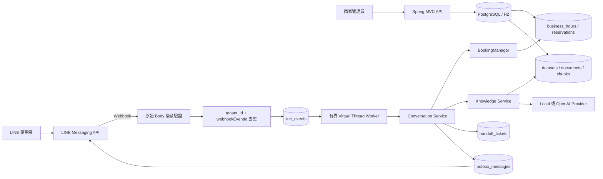

# Spring Boot 系統架構

## 核心決策

服務採 Java 21／Spring Boot 4 模組化單體。HTTP 契約維持原 FastAPI 版本的路徑、Snake Case JSON 與 API Key Header，因此商家端不必因後端語言切換而修改整合。

模組邊界：

- `tenant`：商家、LINE Channel、營業時間及服務設定。
- `booking`：可預約時段、建立、冪等及取消；`BookingManager` 是唯一預約寫入入口。
- `knowledge`：資料集、切塊、Embedding、租戶限定檢索與可信回答。
- `line`：原始 Body 簽章、事件去重、持久化 Worker、對話編排及 Outbox。
- `shared`：API 權限、密碼學與一致的錯誤格式。
- `config`：型別化環境設定與有界 LINE Worker。

Repository 使用 Spring `JdbcClient`，所有租戶資料 SQL 都明確帶入 `tenant_id`。這比在轉換初期依賴隱含 ORM Filter 更容易稽核隔離條件。

## 執行流程

## LINE 事件生命週期

1. 由 URL 中的 `tenantSlug` 取得該商家的加密 Channel 設定。
2. 先用未修改的 HTTP Body 與 Channel Secret 驗證 `X-Line-Signature`，通過後才解析 JSON。
3. 用 `tenant_id + webhookEventId` 建立唯一事件；沒有 Event ID 時使用與舊服務相容的 Body／索引雜湊。
4. Webhook 在事件持久化後立刻回應，避免把模型延遲放在 LINE HTTP Request 內。
5. 排程器每 250ms Claim 可處理事件，由 Semaphore 限制最多 8 個並行工作。
6. Claim 超過兩分鐘仍未完成時會復原為 `RETRY`；每個事件最多嘗試三次，之後標記 `FAILED`。
7. 回覆先建立 Outbox 稽核紀錄。開發模式標記 `SIMULATED`；真實模式呼叫 LINE 後標記 `SENT` 或 `FAILED`。

即使執行多個應用副本，事件 Claim 使用條件式資料庫更新，只有一個 Worker 能取得同一事件。預約寫入另由資料庫唯一限制保護，因此 Event 至少一次處理不會建立重複預約。

## 預約一致性

- 商家設定固定 `slot_minutes`。
- 開始時間必須在未來、落在該日營業時間內，且對齊時段。
- `tenant_id + idempotency_key` 防止相同請求重複建立。
- 有效預約把 `starts_at` 寫入 `active_slot_key`；`tenant_id + active_slot_key` 是唯一限制。
- 取消時將 `active_slot_key` 設為 `NULL`，同時段可以再次預約。
- `ReservationWriter` 使用獨立交易，唯一鍵衝突後主流程仍能查回既有冪等結果。
- LINE Postback 以 `webhookEventId` 形成預約冪等鍵。

未來支援多員工、多房間或非固定時長時，唯一資源需擴充成 `resource_id`，並在 PostgreSQL 使用 Range Exclusion Constraint 防止區間重疊。

## 知識庫與 AI

1. 每個商家只能有一個 `ACTIVE` 資料集。
2. 文件以自然邊界切塊，寫入內容雜湊、Embedding 模型、維度與索引狀態。
3. 發布前確認所有啟用文件皆為 `READY`，且向量模型與目前設定一致。
4. 回答只讀取相同 `tenant_id`、Active Dataset、Embedding 模型與維度的 Chunk。
5. 以 Cosine Similarity 與中英文文字特徵混合排序，並限制 Context 數量與總字數。
6. 達相關性門檻才生成回答；引用由後端檢索結果建立，不採信模型自行產生的來源。
7. 沒有可靠資料時回覆無法確認並提供人工客服選項。

Local Provider 可完全離線驗證。OpenAI Provider 使用 Embeddings 與 Responses API、`store=false`，LINE User ID 先以 HMAC 轉成不可逆穩定識別碼。模型不直接取得資料庫或預約工具權限。

目前向量仍以 JSON 儲存並在應用層掃描，適合 MVP。當單一租戶 Chunk 數達數萬筆或查詢延遲不符目標時，將欄位升級為 pgvector、建立 HNSW 索引並增加 Reranker。

## 為何目前沒有外部 Message Broker

目前需要的是「持久化、可重試、快速回應 Webhook」，而不是跨多個獨立服務廣播事件。PostgreSQL `line_events` 已提供：

- 與接收事件相同資料庫的可靠落盤。
- 唯一鍵去重。
- Claim、重試、失敗狀態與 Crash Recovery。
- 多應用副本安全競爭。
- 少一套 Broker 的部署、監控、備份與權限管理。

RabbitMQ、SQS 或 Kafka 在 API／Worker 需要獨立擴縮、持續高流量、跨服務訂閱、DLQ 管理或資料庫 Claim 形成瓶頸時才有明確收益。完整判準與演進步驟記錄於 [ADR-0001](adr/0001-message-queue.md)。

## 安全邊界

- Platform 與 Tenant API Key 不共用。
- Tenant API Key 以 PBKDF2-HMAC-SHA256 雜湊保存，只在建立時顯示一次。
- LINE Channel Secret／Access Token 以應用金鑰加密。
- 所有租戶 Repository 查詢都明確包含 `tenant_id`。
- Webhook 簽章驗證在 JSON 解析之前完成。
- OpenAI 不取得原始 LINE User ID，且回答請求不保存。
- 只有 `BookingManager` 可以改變預約狀態；AI 只能輸出文字。
- Production 模式拒絕預設管理金鑰與加密金鑰。

正式上線前仍需加入 Secret Manager、管理員 RBAC、限流、Metrics／Tracing、個資保存期限、備份還原演練與檔案惡意內容掃描。
