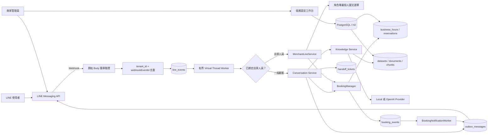

# Spring Boot 系統架構

## 核心決策

服務採 Java 21／Spring Boot 4 模組化單體。HTTP 契約維持原 FastAPI 版本的路徑、Snake Case JSON 與 API Key Header，因此商家端不必因後端語言切換而修改整合。

模組邊界：

- `tenant`：商家、LINE Channel、營業時間及服務設定。
- `booking`：可預約時段、建立、冪等及取消；`BookingManager` 是唯一預約寫入入口。
- `knowledge`：資料集、切塊、Embedding、租戶限定檢索與可信回答。
- `line`：原始 Body 簽章、事件去重、持久化 Worker、對話編排及 Outbox。
- `shared`：API 權限、密碼學與一致的錯誤格式。
- `config`：型別化環境設定與有界 LINE Worker。

Repository 使用 Spring `JdbcClient`。所有可由 API、Session 或 LINE 使用者指定資源的
商家資料 SQL 都明確帶入 `tenant_id`；少數 Worker 內部 Queue 操作以全域 UUID Claim，
只接受前一步從資料庫取得的 ID。這比在轉換初期依賴隱含 ORM Filter 更容易稽核隔離條件。

## 執行流程

## LINE 事件生命週期

1. 由 URL 中的 `tenantSlug` 取得該商家的加密 Channel 設定。
2. 先用未修改的 HTTP Body 與 Channel Secret 驗證 `X-Line-Signature`，通過後才解析 JSON。
3. 用 `tenant_id + webhookEventId` 建立唯一事件；沒有 Event ID 時使用與舊服務相容的 Body／索引雜湊。
4. Webhook 在事件持久化後立刻回應，避免把模型延遲放在 LINE HTTP Request 內。
5. 排程器每 250ms Claim 可處理事件，由 Semaphore 限制最多 8 個並行工作。
6. Claim 超過兩分鐘仍未完成時會復原為 `RETRY`；每個事件最多嘗試三次，之後標記 `FAILED`。
7. 回覆先建立 Outbox 稽核紀錄。開發模式標記 `SIMULATED`；真實模式呼叫 LINE 後標記 `SENT` 或 `FAILED`。

即使執行多個應用副本，事件 Claim 使用條件式資料庫更新，只有一個 Worker 能取得同一事件。預約寫入另由資料庫唯一限制保護，因此 Event 至少一次處理不會建立重複預約。

## 預約一致性

### LINE 行動預約頁

- 單一商家同時只服務一位顧客，所有入口沿用 `tenant_id + active_slot_key` 唯一限制。
- 使用者在 LINE 輸入預約後，可由 Quick Reply 開啟 `/booking/{tenantSlug}`。
- Quick Reply 只開啟預約頁，不再直接用 Postback 建立預約；顧客必須填寫
  姓名後才送出。
- 預約連結包含 30 分鐘有效、加密且不可竄改的身分憑證；憑證綁定商家與 LINE 使用者。
- 憑證放在 URL fragment，瀏覽器載入後立即移入 `sessionStorage` 並清除網址。
- `/booking/api/{tenantSlug}/*` 從 Bearer 憑證取得商家與 LINE 使用者，不接受前端自行指定身分。
- 頁面顯示的時段僅供選擇；確認時仍由 `BookingManager` 重新驗證並建立預約。
- 時段衝突回傳 `409`，頁面保留服務及日期並重新載入可用時段。

- 商家設定固定 `slot_minutes`。
- 開始時間必須在未來、落在該日營業時間內，且對齊時段。
- `tenant_id + idempotency_key` 防止相同請求重複建立。
- 有效預約把 `starts_at` 寫入 `active_slot_key`；`tenant_id + active_slot_key` 是唯一限制。
- 取消時將 `active_slot_key` 設為 `NULL`，同時段可以再次預約。
- `ReservationWriter` 使用獨立交易，唯一鍵衝突後主流程仍能查回既有冪等結果。
- LINE Postback 以 `webhookEventId` 形成預約冪等鍵。
- `booking_slot_occupancies` 以 `tenant_id + starts_at` 統一保護有效預約與
  店家封鎖時段；建立預約或封鎖時都在同一交易取得時段占用。

未來支援多員工、多房間或非固定時長時，唯一資源需擴充成 `resource_id`，並在 PostgreSQL 使用 Range Exclusion Constraint 防止區間重疊。

## 店家 LINE 預約管理

店家日常管理與顧客服務沿用同一個商家 LINE 官方帳號，不需要第二個官方帳號。
店家人員使用自己的私人 LINE 加入商家帳號，透過工作台產生的單次綁定碼建立
`merchant_staff`。LINE User ID 以穩定 HMAC 欄位查詢，並以加密欄位保存供
Push 使用。

LINE 事件進入 Worker 後先交由 `MerchantLineService` 判斷：

1. `綁定 <code>` 只會使用同租戶、未使用且未過期的綁定碼。
2. 已啟用人員輸入 `今日預約`、`明日預約`、`本週預約` 或 `管理預約` 時，
   進入確定性的店家管理流程。
3. `merchant_*` Postback 必須再次確認人員仍為 ACTIVE，取消預約時再檢查
   OWNER／MANAGER 權限。
4. 其他訊息回到既有顧客 Conversation Service；AI 不會取得店家寫入權限。

預約建立或取消時，`BookingManager` 在狀態異動交易中寫入唯一
`booking_events`。通知 Worker 使用 Claim、重試與過期復原處理事件，並以
Outbox `dedupe_key` 避免已成功的接收者在重試時再次收到通知。Push 失敗不會
回滾已成立或已取消的預約。

「開啟預約月曆」會建立十分鐘有效的 `merchant_manage_tokens`：

- Token 放在 URL fragment，頁面載入後以 Bearer 方式單次交換。
- 後端建立一小時 HttpOnly Session，並從網址清除 Token。
- Session 固定 `tenant_id + staff_id`，API 不接受前端自行指定租戶。
- 寫入要求 Session CSRF Token；VIEWER 不能取消、封鎖或解除時段。
- 手機頁提供當日清單、取消、封鎖及解除；文件與 LINE Channel 設定仍留在
  `/portal/`。

### 個人圖文選單與完整工作台登入

顧客與店家人員仍共用同一個商家官方帳號，但顯示不同範圍的圖文選單：

- 商家既有預設圖文選單仍提供給一般顧客，系統不會加入任何管理按鈕。
- `merchant_staff` 完成綁定後，系統依 OWNER／MANAGER／VIEWER 建立並綁定
  Messaging API 的 per-user rich menu。個人選單優先於預設選單。
- 人員角色變更會更新期望角色；停權會把期望狀態改成解除綁定。解除完成後由
  LINE 自動顯示該官方帳號的顧客預設選單。
- 工作台的「移除綁定」會把人員標記為停用並排程解除個人選單；為保留預約
  稽核關聯不會硬刪資料。停用後清單不再顯示，同一個 LINE 日後可重新綁定。
- 圖文選單只提供入口。所有 postback、Token 交換與後續 API 仍重新查詢
  `tenant_id + merchant_staff`、ACTIVE 狀態及角色。

外部 Rich Menu API 不放在人員綁定交易中。`merchant_rich_menu_sync` 保存每位
人員的期望狀態、revision、重試次數與下次執行時間；單執行緒排程 Worker 以
條件式 Claim 處理工作。revision 可防止進行中的舊同步結果覆蓋剛發生的停權或
角色異動。LINE 暫時失敗時採最長五分鐘的漸進退避，綁定本身仍維持成功。

`merchant_rich_menus` 保存每個租戶與角色對應的 LINE rich menu ID。建立流程
以包含介面 revision 的穩定名稱查找既有資源，避免程序在 LINE 建立成功但資料庫
寫入前中斷時反覆建立；圖片上傳成功後才標記 READY。LINE 不允許替換既有 Rich
Menu 圖片，因此介面改版會增加名稱 revision、清除舊 ID 並排程所有已綁定人員
切換到新選單。若連結時收到找不到選單，會清除舊 ID 並於下一次重試重建。

OWNER 的 `merchant_portal` postback 會建立 purpose 為 `PORTAL_LOGIN` 的十分鐘
單次 Token，並以 `/portal/#token=...` 回覆。Portal 前端先清除 URL fragment，
再以 Bearer Token 呼叫 `/portal/api/line-session`。後端消耗 Token、重新確認
ACTIVE OWNER，旋轉 Session ID 並建立 HttpOnly Session 與 CSRF Token。該
Session 保存 `tenant_id + staff_id`，每次 API 呼叫都重新確認 OWNER 權限；
停權或降級後不能沿用既有 Session。

預約頁 Token 使用 `BOOKING_MANAGE` purpose，完整工作台 Token 使用
`PORTAL_LOGIN` purpose，兩者不能跨端點交換。

## 知識庫與 AI

1. 每個商家只能有一個 `ACTIVE` 資料集。
2. 文件以自然邊界切塊，寫入內容雜湊、Embedding 模型、維度與索引狀態。
3. 發布前確認所有啟用文件皆為 `READY`，且向量模型與目前設定一致。
4. 回答只讀取相同 `tenant_id`、Active Dataset、Embedding 模型與維度的 Chunk。
5. 以 Cosine Similarity 與中英文文字特徵混合排序，並限制 Context 數量與總字數。
6. 達相關性門檻才生成回答；引用由後端檢索結果建立，不採信模型自行產生的來源。
7. 沒有可靠資料時回覆無法確認並提供人工客服選項。

Local Provider 可完全離線驗證。OpenAI Provider 使用 Embeddings 與 Responses API、`store=false`，LINE User ID 先以 HMAC 轉成不可逆穩定識別碼。模型不直接取得資料庫或預約工具權限。
離線檢索可用小型、經測試的商務同義詞群補足常見中文問法，但正式語意召回仍應使用 OpenAI Embeddings；不以降低全域相關性門檻取代語意檢索。

目前向量仍以 JSON 儲存並在應用層掃描，適合 MVP。當單一租戶 Chunk 數達數萬筆或查詢延遲不符目標時，將欄位升級為 pgvector、建立 HNSW 索引並增加 Reranker。

## 為何目前沒有外部 Message Broker

目前需要的是「持久化、可重試、快速回應 Webhook」，而不是跨多個獨立服務廣播事件。PostgreSQL `line_events` 已提供：

- 與接收事件相同資料庫的可靠落盤。
- 唯一鍵去重。
- Claim、重試、失敗狀態與 Crash Recovery。
- 多應用副本安全競爭。
- 少一套 Broker 的部署、監控、備份與權限管理。

RabbitMQ、SQS 或 Kafka 在 API／Worker 需要獨立擴縮、持續高流量、跨服務訂閱、DLQ 管理或資料庫 Claim 形成瓶頸時才有明確收益。完整判準與演進步驟記錄於 [ADR-0001](adr/0001-message-queue.md)。

## 安全邊界

- Platform 與 Tenant API Key 不共用。
- Tenant API Key 以 PBKDF2-HMAC-SHA256 雜湊保存，只在建立時顯示一次。
- LINE Channel Secret／Access Token 以應用金鑰加密。
- 所有租戶 Repository 查詢都明確包含 `tenant_id`。
- Webhook 簽章驗證在 JSON 解析之前完成。
- OpenAI 不取得原始 LINE User ID，且回答請求不保存。
- 只有 `BookingManager` 可以改變預約狀態；AI 只能輸出文字。
- 店家管理指令先驗證 `tenant_id + merchant_staff`，所有 Postback 與手機
  Session 都重新檢查人員狀態及角色。
- 店家綁定碼與手機管理 Token 都短效、單次使用，資料庫只保存 HMAC。
- Rich Menu 不是授權依據；即使管理網址外流，仍須通過 purpose 限定的單次
  Token、ACTIVE 人員狀態與伺服器端角色檢查。
- 顧客預設選單與店家個人選單分離；只有已綁定人員會建立 per-user 同步工作。
- 預約與封鎖共用資料庫唯一時段占用，不依賴前端「先查再寫」。
- Production 模式拒絕預設管理金鑰與加密金鑰。
- 回應套用 CSP、Frame 防護、`nosniff`、Referrer 與 Permissions Policy；Production
  另啟用 HSTS，敏感 API 回應使用 `Cache-Control: no-store`。
- 商家工作台以 Tenant API Key 換取 HttpOnly Session，API Key 不保存於瀏覽器。
- 工作台所有資料仍由伺服器 Session 決定 `tenant_id`，不接受前端自行指定租戶。
- 工作台寫入操作要求與 Session 綁定的 CSRF Token；正式環境 Cookie 必須啟用 Secure。

## 商家工作台

`/portal/` 與 Spring Boot API 同源部署，避免在第一階段增加第二套前端部署與
跨來源權限設定。工作台透過 `/portal/api/*` Session API 呼叫既有
`TenantService`、`KnowledgeService`，不複製商業規則。

目前支援商家建立／登入、設定完成度、LINE Channel、文字與 UTF-8
TXT／Markdown／CSV 匯入、索引、發布及回答測試。檔案大小先限制為 1 MB，
文件內容限制為 100,000 字，並由 Spring Multipart 在進入應用邏輯前拒絕
過大請求。

工作台的回答測試會將目前選取的 `datasetId` 傳給 `/portal/api/answer`，
後端以 Session 租戶重新驗證資料集歸屬，因此可在發布前預覽草稿。正式
`/api/v1/tenants/{tenantId}/ai/answer` 與 LINE 對話仍只讀取 Active Dataset。

歷史對話匯入會採獨立流程：檔案掃描、格式解析、個資遮蔽、候選 FAQ 萃取、
人工核准、加入草稿、索引與發布。未核准的對話不能進入 Active Dataset。

正式上線前仍需完成受管 Secret Manager 與輪替、登入及高成本端點限流、
Metrics／Tracing／告警、個資保存期限與刪除流程、備份還原演練，以及檔案惡意內容掃描。
